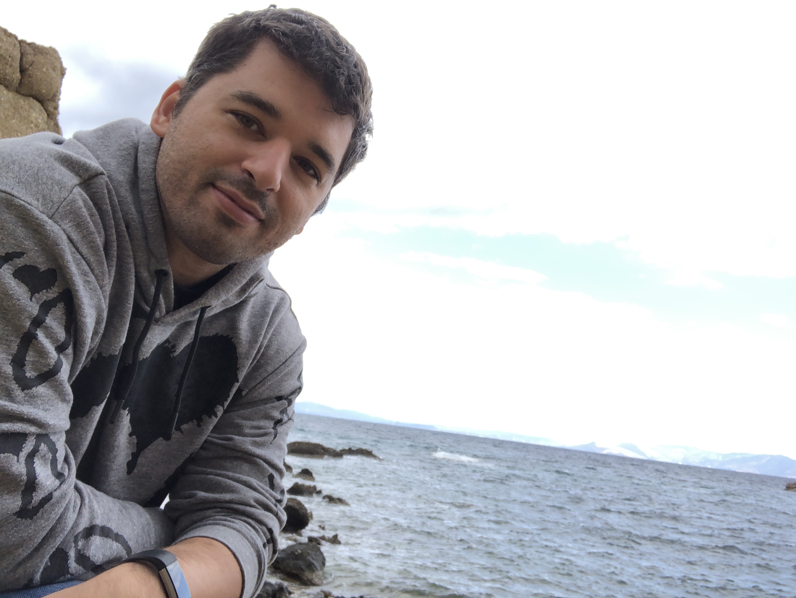

### About

I come from beautiful Greece. Born and raised in Gerakas, Athens, I always feel nostalgic when I visit my village Figaleia and the nearby temple of [Apollo Epicurius](https://whc.unesco.org/en/list/392/) in Peloponnese. 

I'm a molecular biologist ([BSc, Democritus University of Thrace](http://www.mbg.duth.gr/)) once trained as an experimentalist ([yeast times...](https://www.embopress.org/doi/10.1038/emboj.2009.226)) and who has since then been interested in bioinformatics and computational genomics ([MSc and PhD in Bioinformatics, University of Athens & NCSR "Demokritos"](http://www.demokritos.gr/?lang=en)). I currently work as a Senior Data Scientist at [AstraZeneca's](https://www.astrazeneca.com/) Oncology R&D Team in Cambridge with the aim to find better drugs for oncology patients. Prior to that, I was a Data Scientist for [Genomics England](https://www.genomicsengland.co.uk/) helping to deliver the [100K Genomes project](https://en.wikipedia.org/wiki/100,000_Genomes_Project) and helping to build the infrastructure for the Genomic Medicine Service in the NHS. During the later times of my academic life, I spent two years as an MRC Postdoctoral (and now visiting) scientist at [Boris Lenhard's group](http://group.genereg.net/people/alumni/) at the MRC London Institute of Medical Sciences & Imperial College London working on a largely enigmatic class of genomic elements called [Conserved Non-coding Elements (CNEs)](https://academic.oup.com/nar/advance-article/doi/10.1093/nar/gkx1074/4599184). I am also a visiting scientist at the [NCSR Demokritos](http://www.demokritos.gr/?lang=en) where I participate in the [BioASQ project](http://bioasq.org/). 

I have published papers as first or corresponding author in peer-reviewed journals in diverse fields including medicine (rare diseases and cancer), experimental biology, machine Learning, N-gram graphs, computational genomics, algorithm development in computational biology and next generation sequencing. Many of those papers have been published in prestigious journals such as Nature, Nucleic Acids Research, Genome Research, Bioinformatics, etc. I am a member of the [Genomics England Research Consortium](https://public.huddle.com/a/kzWvRoL/index.html) and also a member of the [BioASQ project](http://bioasq.org/).

A copy of my current CV can be found here: [CV](https://www.dropbox.com/s/yazd41wvo03ljk2/Polychronopoulos_cv_en.pdf?dl=0)

- [Google Scholar](https://scholar.google.com/citations?user=LsI4gg0AAAAJ) profile
- Publications
  - [Pubmed](https://www.ncbi.nlm.nih.gov/pubmed/?term=((Polychronopoulos+D.)+NOT+2010%5BDate+-+Publication%5D+NOT+1991%5BDate+-+Publication%5D)) 
  - [dblp](https://dblp.uni-trier.de/pers/hd/p/Polychronopoulos:Dimitris)

### LATEST NEWS
- **Paper accepted at [Journal for Immunotherapy of Cancer - IF:10.252](https://jitc.bmj.com/content/8/Suppl_3/A295)**
- **Paper [Whole genome sequencing for diagnosis of neurological repeat expansion disorders](https://www.biorxiv.org/content/10.1101/2020.11.06.371716v1?fbclid=IwAR3HUKX3pgqy-90iGGdphCLwkeWE6hAYGsToTUnR3V5XutX-EBSsb7az7Tc) submitted to Biorxiv**
- **I will be presenting with Miika at the University of Cambridge about [*AstraZeneca Oncology Bioinformatics case studies and the skill sets we value*](http://talks.cam.ac.uk/talk/index/151051)**

### Connect via

- [GitHub](https://github.com/dpolychr)
- [Twitter](https://twitter.com/dpolychr2)
- [LinkedIn](https://uk.linkedin.com/in/dimitris-polychronopoulos-b3732a134)
- [Facebook](https://www.facebook.com/dimitris.polychronopoulos.353)
- [Instagram](https://www.instagram.com/dpolychr/)

### Trivia
My [Erdős number](https://www.oakland.edu/enp/) is at most 4 via Philipp Bucher → Samuel Karlin → Allan Pinkus → Paul Erdős.

