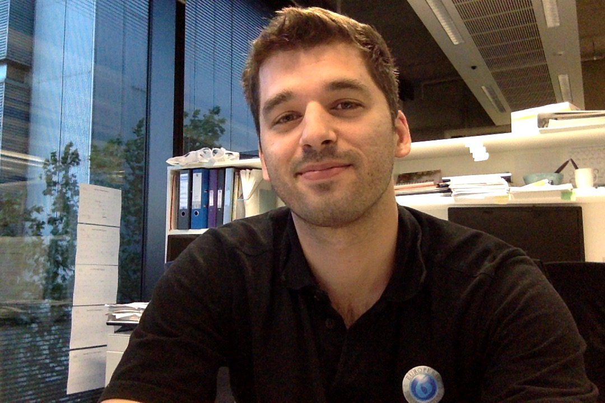

### About

I come from beautiful Greece. Born and raised in Gerakas, Athens, I always feel nostalgic when I visit my village Figaleia and the nearby temple of [Apollo Epicurius](https://whc.unesco.org/en/list/392/) in Peloponnese. 

I'm a molecular biologist ([BSc, Democritus University of Thrace](http://www.mbg.duth.gr/)) once trained as an experimentalist ([yeast times...](https://www.embopress.org/doi/10.1038/emboj.2009.226)) and who has since more than a decade now been interested in bioinformatics and computational genomics ([MSc and PhD in Bioinformatics, University of Athens & NCSR "Demokritos"](http://www.demokritos.gr/?lang=en)). 

I currently work as an Associate Director, Oncology Bioinformatics & Data Science at [AstraZeneca's](https://www.astrazeneca.com/) Oncology R&D Team in Cambridge with the aim to find better drugs for oncology patients. Prior to joining AZ, I was a Data Scientist for [Genomics England](https://www.genomicsengland.co.uk/) delivering the [100K Genomes Project](https://en.wikipedia.org/wiki/100,000_Genomes_Project), the [100K Genomes Project Pilot](https://www.nejm.org/doi/full/10.1056/NEJMoa2035790) and helping to build the infrastructure for the [Genomic Medicine Service](https://www.england.nhs.uk/genomics/nhs-genomic-med-service/) in the NHS. 

During the later times of my academic life, I spent two years as an MRC Postdoctoral (and now visiting) scientist at [Boris Lenhard's group](http://group.genereg.net/people/alumni/) at the MRC London Institute of Medical Sciences & Imperial College London working on a largely enigmatic class of genomic elements called [Conserved Non-coding Elements (CNEs)](https://academic.oup.com/nar/advance-article/doi/10.1093/nar/gkx1074/4599184). I am also a visiting scientist at the [NCSR Demokritos](http://www.demokritos.gr/?lang=en) where I participate in the [BioASQ project](http://bioasq.org/). 

My work spans various fields including medicine (rare diseases and cancer), experimental biology, machine Learning, N-gram graphs, computational genomics, algorithm development in computational biology and next generation sequencing, and has been published in peer-reviewed journals including NEJM, Lancet Neurology, Nature, Nature Cancer, Nucleic Acids Research, Genome Research, Bioinformatics.

A copy of my current CV can be found here: [CV](https://www.dropbox.com/s/5r2f4jdidvuyc8r/Polychronopoulos_cv_en.pdf?dl=0)

- [Google Scholar](https://scholar.google.com/citations?user=LsI4gg0AAAAJ)
- [Scopus](https://www.scopus.com/authid/detail.uri?authorId=57211826120)
- [Pubmed](https://www.ncbi.nlm.nih.gov/pubmed/?term=((Polychronopoulos+D.)+NOT+2010%5BDate+-+Publication%5D+NOT+1991%5BDate+-+Publication%5D)) 
- [dblp](https://dblp.uni-trier.de/pers/hd/p/Polychronopoulos:Dimitris)

### LATEST NEWS
- **[Our pilot study](https://www.nejm.org/doi/full/10.1056/NEJMoa2035790?fbclid=IwAR3_GnsHjHJQmGCcRL4oM_m3YqVCHVr8chHCTeRYNyju4bqPpcTQt75zFjk) of whole genome sequencing (WGS) in rare disease diagnosis in a national health care system published at The New England Journal of Medicine** 
- **Happy to join the Editorial Board of [BMC Medical Genomics](https://bmcmedgenomics.biomedcentral.com/about/editorial-board)**
- **[Our study](https://www.thelancet.com/journals/laneur/article/PIIS1474-4422(21)00462-2/fulltext) on "Whole genome sequencing for the diagnosis of neurological repeat expansion disorders in the UK: a retrospective diagnostic accuracy and prospective clinical validation study" published at The Lancet Neurology**

### Connect via

- [ResearchGate](https://www.researchgate.net/profile/Dimitris_Polychronopoulos)
- [GitHub](https://github.com/dpolychr)
- [Twitter](https://twitter.com/dpolychr2)
- [LinkedIn](https://uk.linkedin.com/in/dimitris-polychronopoulos-b3732a134)

### Trivia
My [Erdős number](https://www.oakland.edu/enp/) is at most 3 via Costas S. Iliopoulos → David E. Daykin → Paul Erdős.

 
 <a href='http://www.counter-zaehler.de'>counter kostenlos</a> 

