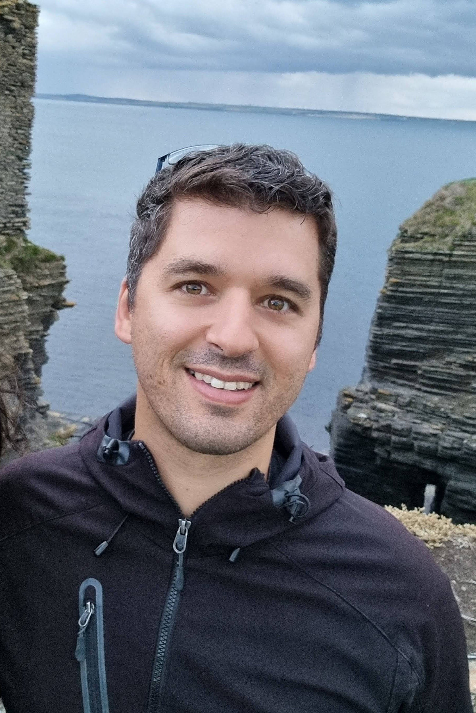

<!------> 

### About

I’m a computational biologist and AI/data leader working at the intersection of life sciences, healthcare and technology.

I currently work as an Associate Director within the Life Sciences R&D practice at Deloitte, helping clients address complex R&D and healthcare challenges using AI/ML, data and emerging technologies. My work spans strategy, data and AI architecture, governance, delivery and the translation of emerging technologies into practical capabilities.

My career has taken me from genomics and academic research, through pharma and biotech, to consulting. I was part of the UK [100,000 Genomes Project](https://en.wikipedia.org/wiki/100,000_Genomes_Project) at [Genomics England](https://www.genomicsengland.co.uk/), where I worked on large-scale genomic data and helped build the infrastructure supporting the [Genomic Medicine Service](https://www.england.nhs.uk/genomics/genomic-medicine-service/) in the NHS. I subsequently spent several years in Oncology R&D at [AstraZeneca](https://www.astrazeneca.com/), applying bioinformatics, data science and AI to drug discovery.

I then joined [Ochre Bio](https://www.ochre-bio.com/) as its founding Director of In Silico Biology and Head of Discovery. There I built and led a global, multidisciplinary team of computational scientists working across imaging, statistics, functional and computational genomics, knowledge graphs and AI/ML, with a focus on applying these capabilities to drug discovery.

I subsequently co-founded [CureCollect](https://www.curecollect.com/) and served as Chief Data Officer, helping build an early-stage biotech focused on collecting, structuring and analysing diverse multimodal data from the developing world for oncology research.

Academically, I originally trained as a molecular biologist ([BSc, Democritus University of Thrace](http://www.mbg.duth.gr/)) and began my career as an experimental scientist. I then moved into bioinformatics and computational biology, completing an MSc and PhD in Bioinformatics at the [University of Athens](http://www.uoa.gr/) and [NCSR Demokritos](http://www.demokritos.gr/?lang=en). Following PhD, I spent two years as an MRC Postdoctoral Scientist at the [MRC London Institute of Medical Sciences](https://www.imperial.ac.uk/lms/) & Imperial College London, working in [Boris Lenhard's group](http://group.genereg.net/people/alumni/) on a largely enigmatic class of genomic elements called [Conserved Non-coding Elements (CNEs)](https://academic.oup.com/nar/advance-article/doi/10.1093/nar/gkx1074/4599184). I am also a visiting scientist at [NCSR Demokritos](http://www.demokritos.gr/?lang=en), where I participate in the [BioASQ project](http://bioasq.org/).

My work sits at the intersection of biology, data and AI, with interests spanning genomics, multimodal biological data, computational biology, knowledge graphs, AI/ML and data-driven drug discovery. My research has been published in journals including *NEJM*, *Lancet Neurology*, *Nature*, *Nature Cancer*, *Nucleic Acids Research*, *Genome Research* and *Bioinformatics*.

I have published widely in computational biology and biomedical research, with ~6,000 citations and an h-index of 26

A copy of my current CV can be found [here](https://drive.google.com/file/d/14YYpbpTTSvFXvwWwVdues0qfj605UktX/view?usp=sharing).

- [Google Scholar](https://scholar.google.com/citations?user=LsI4gg0AAAAJ)
- [Scopus](https://www.scopus.com/authid/detail.uri?authorId=57211826120)
- [PubMed](https://pubmed.ncbi.nlm.nih.gov/?term=%28%28Polychronopoulos+D.%29+NOT+2010%5BDate+-+Publication%5D+NOT+1991%5BDate+-+Publication%5D%29+NOT+Drammen%5Baffil%5D&sort=date)
- [DBLP](https://dblp.uni-trier.de/pers/hd/p/Polychronopoulos:Dimitris)

### Selected work & publications

- **[Knowledge graphs for CRISPR screens](https://www.nature.com/articles/s41467-022-29292-7)** — applying knowledge graphs to CRISPR screens to identify novel drivers of resistance to cancer treatments.
- **[100,000 Genomes Project](https://www.nejm.org/doi/full/10.1056/NEJMoa2035790)** — contributing to the analysis of national-scale genomic data and the development of genomic medicine in the NHS.
- Technical editor for Manning's *Knowledge Graphs and LLMs in Action* and reviewer of *Automated Machine Learning in Action*.

### Connect

- [LinkedIn](https://uk.linkedin.com/in/dimitris-polychronopoulos-b3732a134)
- [GitHub](https://github.com/dpolychr)
- [Google Scholar](https://scholar.google.com/citations?user=LsI4gg0AAAAJ)
- [ResearchGate](https://www.researchgate.net/profile/Dimitris_Polychronopoulos)
- [Scopus](https://www.scopus.com/authid/detail.uri?authorId=57211826120)
- [PubMed](https://pubmed.ncbi.nlm.nih.gov/?term=%28%28Polychronopoulos+D.%29+NOT+2010%5BDate+-+Publication%5D+NOT+1991%5BDate+-+Publication%5D%29+NOT+Drammen%5Baffil%5D&sort=date)

### A little more about me

I come from beautiful Greece. I was born and raised in Gerakas, Athens, and still feel nostalgic when I visit my village, Figaleia, and the nearby temple of [Apollo Epicurius](https://whc.unesco.org/en/list/392/) in the Peloponnese.

My [Erdős number](https://www.oakland.edu/enp/) is at most 3 via Costas S. Iliopoulos → David E. Daykin → Paul Erdős.

 
 <a href='https://www.acadoo-medizin.com/'>Doktorarbeit Medizin Hilfe</a> 

