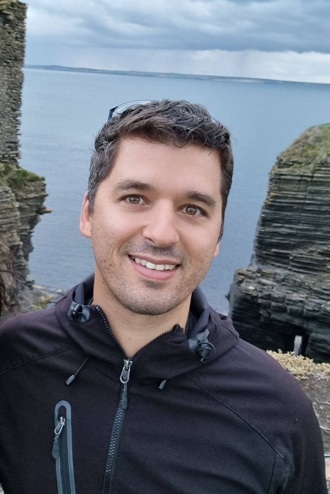

<!------> 

### About

I come from beautiful Greece. Born and raised in Gerakas, Athens, I always feel nostalgic when I visit my village Figaleia and the nearby temple of [Apollo Epicurius](https://whc.unesco.org/en/list/392/) in Peloponnese. 

I'm a molecular biologist ([BSc, Democritus University of Thrace](http://www.mbg.duth.gr/)) once trained as an experimentalist ([yeast times...](https://www.embopress.org/doi/10.1038/emboj.2009.226)) and who has since almost a couple of decades now been interested in bioinformatics, data science and personalised medicine ([MSc and PhD in Bioinformatics, University of Athens & NCSR "Demokritos"](http://www.demokritos.gr/?lang=en)). 

I was Chief Data Officer and co-founder at [CureCollect](https://www.curecollect.com/), an early stage biotech with a mission to collect, structure and analyse diverse, multi-modal data from the developing world for the benefit of oncology patients globally. 

Prior CureCollect, I was [Ochre Bio](https://www.ochre-bio.com/)'s founding Director of In Silico Biology and Head of Discovery. At Ochre Bio I built and led a global team of computational scientists with expertise ranging from imaging, statistics, functional & computational regulatory genomics to knowledge graphs, recommendation systems and their applications to drug discovery.

Prior Ochre Bio, I was an Associate Director, Oncology Bioinformatics & Data Science at [AstraZeneca's](https://www.astrazeneca.com/) Oncology R&D Team in Cambridge where I was responsible for Discovery Data Science efforts with the aim to develop better small-molecule drugs for oncology patients. Before AZ, I worked as a Data Scientist for [Genomics England](https://www.genomicsengland.co.uk/) delivering the [100K Genomes Project](https://en.wikipedia.org/wiki/100,000_Genomes_Project), the [100K Genomes Project Pilot](https://www.nejm.org/doi/full/10.1056/NEJMoa2035790), and helping to build the infrastructure for the [Genomic Medicine Service](https://www.england.nhs.uk/genomics/nhs-genomic-med-service/) in the NHS. 

During the later times of my academic life, I spent two years as an MRC Postdoctoral (and now visiting) scientist at [Boris Lenhard's group](http://group.genereg.net/people/alumni/) at the MRC London Institute of Medical Sciences & Imperial College London working on a largely enigmatic class of genomic elements called [Conserved Non-coding Elements (CNEs)](https://academic.oup.com/nar/advance-article/doi/10.1093/nar/gkx1074/4599184). I am also a visiting scientist at the [NCSR Demokritos](http://www.demokritos.gr/?lang=en) where I participate in the [BioASQ project](http://bioasq.org/). 

My work spans various fields including medicine (rare diseases and cancer; 100K Genomes Project; DNA replication), AI/ML including [knowledge graphs](https://www.nature.com/articles/s41467-022-29292-7) and algorithm development in biology ([CNEFinder](https://academic.oup.com/bioinformatics/article/34/17/i743/5093238), [CNEr](https://journals.plos.org/ploscompbiol/article?id=10.1371/journal.pcbi.1006940), [oncoEnrichR](https://onlinelibrary.wiley.com/doi/full/10.1002/ijc.34666), [avoided words](https://almob.biomedcentral.com/articles/10.1186/s13015-017-0094-z)). It has been published in various peer-reviewed journals including NEJM, Lancet Neurology, Nature, Nature Cancer, Nucleic Acids Research, Genome Research, Bioinformatics.

A copy of my current CV can be found here: [CV](https://drive.google.com/file/d/1L_ljUXpV_MB5KX3XJTkMA4PxvRldxGua/view?usp=sharing)

- [Google Scholar](https://scholar.google.com/citations?user=LsI4gg0AAAAJ)
- [Scopus](https://www.scopus.com/authid/detail.uri?authorId=57211826120)
- [Pubmed](https://pubmed.ncbi.nlm.nih.gov/?term=%28%28Polychronopoulos+D.%29+NOT+2010%5BDate+-+Publication%5D+NOT+1991%5BDate+-+Publication%5D%29+NOT+Drammen%5Baffil%5D&sort=date) 
- [dblp](https://dblp.uni-trier.de/pers/hd/p/Polychronopoulos:Dimitris)

### LATEST NEWS
- **[Our latest publication in Nature Communications](https://www.nature.com/articles/s41467-022-29292-7) describes the application of knowledge graphs to CRISPR screens to identify novel drivers of resistance to cancer treatments**
- **Happy to join the Editorial Board of [BMC Bioinformatics](https://bmcbioinformatics.biomedcentral.com/about/editorial-board)**

### Connect via

- [ResearchGate](https://www.researchgate.net/profile/Dimitris_Polychronopoulos)
- [GitHub](https://github.com/dpolychr)
- [Twitter](https://twitter.com/dpolychr2)
- [LinkedIn](https://uk.linkedin.com/in/dimitris-polychronopoulos-b3732a134)

### Trivia
My [Erdős number](https://www.oakland.edu/enp/) is at most 3 via Costas S. Iliopoulos → David E. Daykin → Paul Erdős.

 
 <a href='http://www.counter-zaehler.de'>counter kostenlos</a> 

